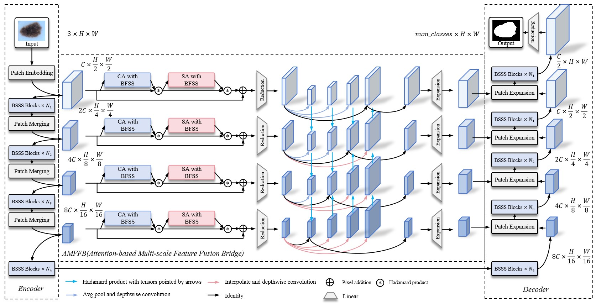

# Mamba-MIS

**Medical image segmentation via visual bidirectional state space model with attention-based multi-scale feature fusion bridge and spectral gate**

Yang Wen 1, Shunzhe Shen1, Wuzhen Shi1, Wenming Cao1, Bin Sheng2

1Guangdong Key Laboratory of Intelligent Information Processing, School of Electronics Information Engineering, Shenzhen University, Shenzhen, 518060, China

2Department of Comupter Science and Engineering, Shanghai Jiao Tong University, Shanghai, 200240, China

## Todo
(Future) ***To upload the code.***

(2024.10.22) ***Repo established.***
## Abstract
Medical image segmentation aims to accurately identify and distinguish pixels representing organs or lesions in medical images, which is a significant task in the field of medical imaging. Although current methods have achieved impressive performance, some
challenging issues still need to be addressed. Firstly, traditional CNN-based methods often face difficulties in capturing essential long-range information. Although Transformer-based models are effective for global modeling, they are computationally intensive,
which can be challenging for research institutions or hospitals with limited resources. Secondly, current methods lack the ability to model the interrelationships between features at different levels, making it difficult to fully utilize both high-level semantic information and fine details, which leads to inaccurate segmentation results. To address the aforementioned issues, we propose a visual
bidirectional state space model (SSM) for medical image segmentation, named Mamba-MIS. Specifically, Mamba-MIS leverages the characteristics of SSM to effectively handle long-range dependencies while maintaining linear computational complexity. To
adapt SSM for medical imaging, we introduce the bidirectional fusion selective scanning (BFSS) to efficiently traverse the spatial domain and convert non-causal visual images into ordered patch sequences, and effectively model the relationships between
different positions in various directional sequences. In addition, the creatively proposed spectral gates (SGs) further enhance the modeling of global dependencies in the frequency domain and increase feature diversity. To comprehensively model the inter-
relationships between feature maps at various levels, we propose an attention-based multi-scale feature fusion bridge (AMFFB), which employs spatial and channel attention with BFSS (SCABFSS) to emphasize the significant features of each level’s feature map. Meanwhile, it integrates the local spatial and global channel features of each level, while blending high-level abstract features
with low-level detailed feature maps across different levels. To verify the capabilities and effectiveness of our proposed Mamba-MIS, extensive experiments are conducted on polyp and skin lesion segmentation tasks using multiple released public datasets.
Experimental results fully demonstrate that our proposed Mamba-MIS can achieve superior segmentation performance and provide surgeons with more accurate diagnostic advice compared to other state-of-the art methods.

